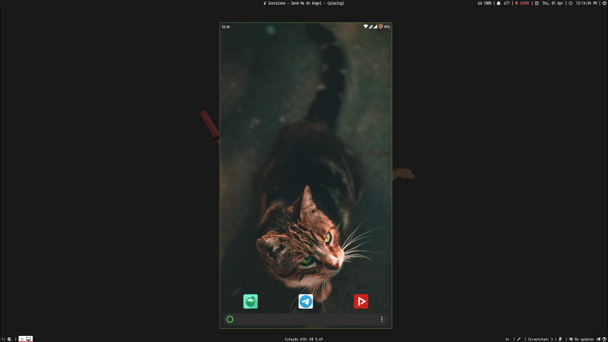
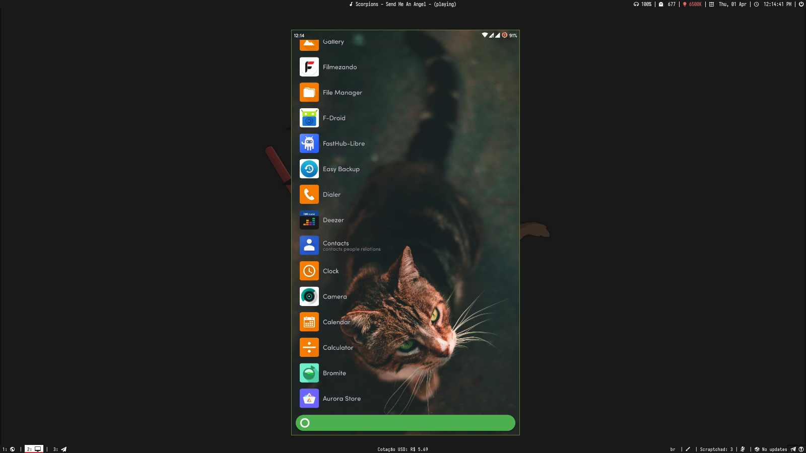
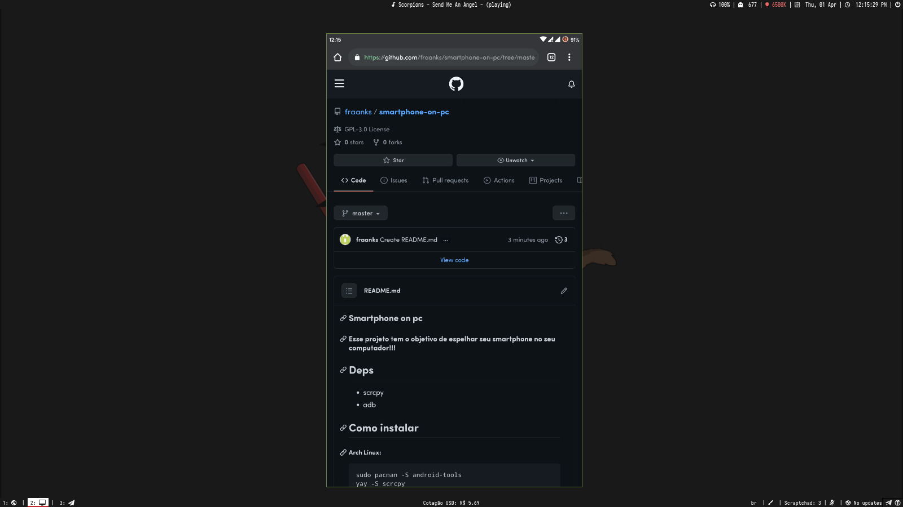

### Smartphone on pc

#### Esse projeto tem o objetivo de espelhar seu smartphone no seu computador!!!







## Deps
- scrcpy
- adb

## Como instalar

##### Arch Linux:
```
sudo pacman -S android-tools scrcpy
```

# Siga os passos a seguir:

##### Primeiro você tem que jogar os scripts no seu PATH (Normalmente se localiza em: ~/.local/bin)

##### Dentro do PATH execute:
```
wget -c https://github.com/ffraanks/smartphone-on-pc/raw/master/scrcpy-cli
wget -c https://github.com/ffraanks/smartphone-on-pc/raw/master/cabo-usb
wget -c https://github.com/ffraanks/smartphone-on-pc/raw/master/cabo-resolution
wget -c https://github.com/ffraanks/smartphone-on-pc/raw/master/wifi-connect
wget -c https://github.com/ffraanks/smartphone-on-pc/raw/master/wifi-resolution
```

#### De permissão de execução para os scripts:
```
chmod +x scrcpy-cli
chmod +x cabo-usb
chmod +x cabo-resolution
chmod +x wifi-connect
chmod +x wifi-resolution
```

### Como usar:

Execute apenas o ***scrcpy-cli*** no seu terminal.

### Contato

[Telegram](https://t.me/FranklinTech)

[Scrcpy Project](https://github.com/Genymobile/scrcpy)
